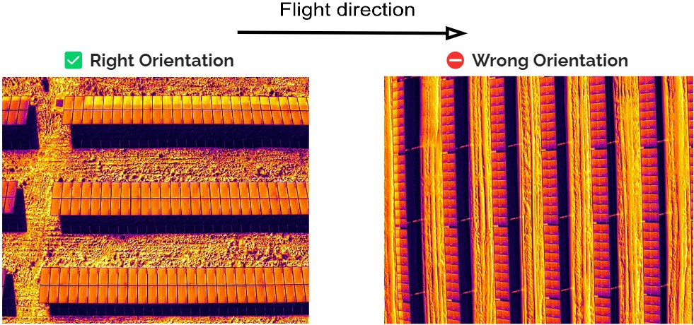

### UAV Thermography Procedures

# DATA COLLECTION

## 1. Hardware
- UAV: DJI Matrice 300 RTK
- Camera: DJI H20T (Calibration certificate: Issue date less than 1 year)
- Storage: MicroSD card 32GB or more (see camera manual to see options recommended)
- RTK Base: DJI D-RTK 2

## 2. Software
- UgCS (lastest desktop version for Windows, macOS or Ubuntu)
- UgCS for DJI (lastest Android version for DJI Matrice 300 controller) 

## 3. Before Take-off conditions & recommendations
- Make sure that camera lens are cleans
- Make sure that the RTK base is placed in a unique location for all the flight missions. If you have to collect images in several days, you must place the RTK base in the same place for each day. To ensure the location you can use the "Fix" feature of the RTK in the remote controller of the drone.
- Calibrate the gimbal

## 4. Fligh Settings for Photovoltaic Power Plants
### 4.1 UgCS flight parameters

||RGB Orthomosaic  |Thermal single image analysis  |
|----------------|:---------------:|:-----------------------------:|
|*Image Formats* |JPG| R-JPG|
|*Flight speed*  |7 m/s|4 m/s|
|*Turn type*  |Stop and turn           | Stop and turn|
|*Camera*  |Zoom 1x|Thermal IR + Zoom 1x|
|*GSD*  |5 cm/px| Thermal IR: 4 cm/px,  Zoom: 1 cm/px|
|*Foward Overlap*|80%|50%|   
|*Side Overlap*|80%|50%|  
|*Direction flight angle* || Plants with trackers: 0°,  whitout trackers: 90°|
|*Altitud mode*|AGL, 3m tolerance |AGL, 3m tolerance|  
|*Change yaw* (relative to north) || Plants with trackers: 270°,  whitout trackers: 180°|
|*Set camera by distance*|Auto|Auto|  
|*Gimbal pitch*|-90°| -90°|

### 4.2 Image Orientation

### 4.3 Minimun flight and weather conditions

##### 4.3.1 RGB Orthomosaic 
|Aspect|Condition |
|-|-|
|Area coverage|Take wide coverage of the edges of the plant, so that it covers more than 30 m with respect to the panels at each limit of the plant|
|*Time schedule*| Shadows cast on the ground should be avoided in at least 50% of the area between rows of panels. Also avoid solar reflections on the panels. In most cases, the most convenient time to meet these conditions is between 10:00 and 11:00 in the morning, and between 1:00 and 3:00 p.m. in the afternoon, but it must be validated for each location because it will depend on the latitude|

##### 4.3.2 Thermal images 
|Aspect|Condition |
|-|-|
|*Irradiance*| Greater than 600 W/m2|
|*Time schedule*| Adequate to avoid sun reflections in panels, either solar reflection or thermal reflection from other panels. In most cases, the most convenient time to meet these conditions is between 9:30 and 11:30 in the morning, and between 13:00 and 16:00 p.m. in the afternoon, but it must be validated for each location because it will depend on the latitude|
|*Area coverage*| Each flight mission must correspond to the true sub zones delimitation according to the layout of the plant for easy reference. The images collection for each sub zone should be taken in the same flight mission|

|
### **5. Deliverables**
#### 5.1 Images 
- Dataset of Zoom RGB Images (.JPG) for RGB Orthomosaic construction
- Dataset of thermal radiometric (.RJPG) & zoom images 1X (.JPG) for thermal single image analysis 
*Note: for both cases, image should have the correspondig resolution, quality and none motion blur / trepidation a,d include all the metadata*

#### 5.2 Technical support data
- Photovoltaic plan detailed layouts, where it shows subzone divisions, quantity of panels and weather stations location
- Weather data: Every 10 minutes or less, It should take the values ​​of the following conditions: horizontal & inclined irradiance, relative humidity, ambient temperature and modules temperature.  The data from the weather stations of the photovoltaic plant can be used.

