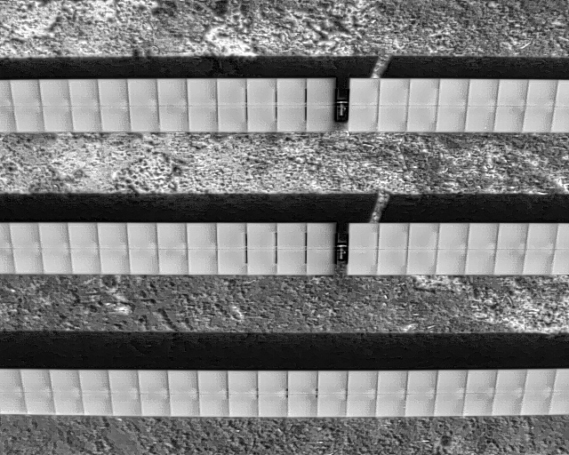

### UAV Thermography Procedures

# DATA PREPROCESSING

## 1. Reading image metadata
This step allows verifying that images have the necessary metadata to be able to carry out the thermography processing.
For reading images meta information you can use the application **ExifTool by Phil Harvey**. Clic [**here**](https://exiftool.org/) you go its website where you can read the instructions to install and use this aplication depending on your operation system.

### 1.1 Single image metadata
Below we show the structure of the metadata for the images used in UAV thermography.

|Camera|Mode|Example of Image File |Example of ExifTool Output File|
|-|-|:-:|-|
|DJI H20T|RGB Zoom|[DJI_20220902160959_0019_Z.JPG](resources/data_preprocessing/DJI_20220902160959_0019_Z.JPG) |[DJI_20220902160959_0019_Z.txt](resources/DJI_20220902160959_0019_Z.txt)|
|DJI H20T|IR Thermal|[DJI_20220902151742_0028_T.JPG](resources/data_preprocessing/DJI_20220902151742_0028_T.JPG) |[DJI_20220902151742_0028_T.txt](resources/data_preprocessing/DJI_20220902151742_0028_T.txt)|

### 1.2 Batch metadata
To get a .CSV file containing all the metadata for an image set, run the following code at the command console located in the directory where ExifTool is located

    exiftool -r -csv -EXIF:All -xmp:All  -charset filename=utf8 “PATH TO IMAGES FOLDER" > “PATH TO IMAGE FOLDER\metadata.csv"

## 2. Checking spatial coverage of images
This step permits verifying that images have geographically covered  all the expected area to analise. To achive this, you can use the latest version of **QGIS**. Clic [**here**](https://www.qgis.org/) you go its website.

Steps: 
1. From the main menu of QGIS, run Web > QuickMapServices > Google > Google Satellite to habilitate the map in the background
2. Then run Processing > Toolbox
3. Search the "Import geotagged photos"
4. Select the input folder that contains your images dataset. Pres Run.
5. Make zoom to view the layer generated.
 
You should have a result like this: 

## 3. Checking that thermal images are radiometric
Radiometric for a thermal image means that you can adjust some parameters to calculate each pixel temperature. This parameters are: emissivity, distance from the object, reflected temperature and relative humidity. To check this you should use the camera manufacturer software. For DJI H20T thermal images you can use the latest version of **DJI Thermal Analisys Tool**. Clic [**here**](https://www.dji.com/downloads/softwares/dji-dtat3/) you go its website.

|*Content Maintainer*|
|-|
|*Hector Jose Bastidas Gonzalez* *hector.bastidas@simplemap.io*|