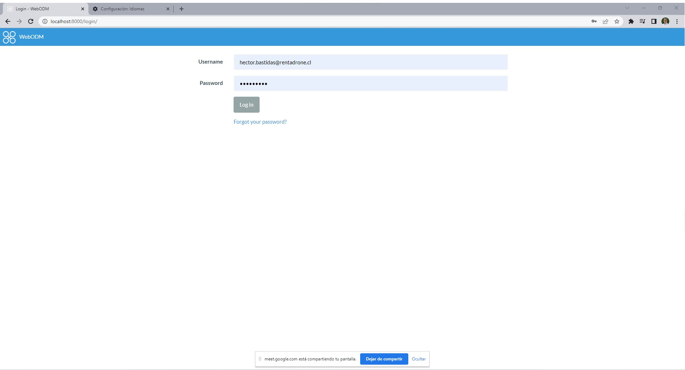
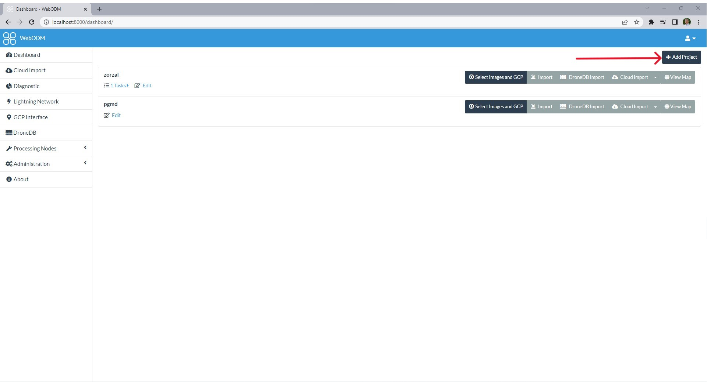
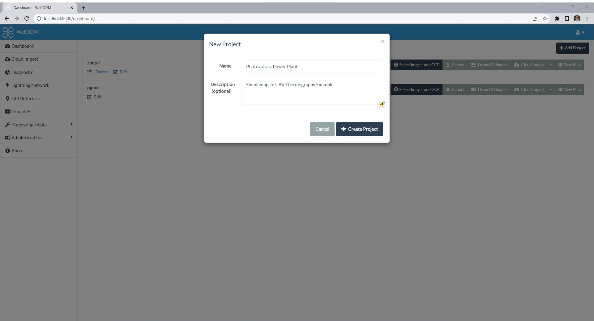
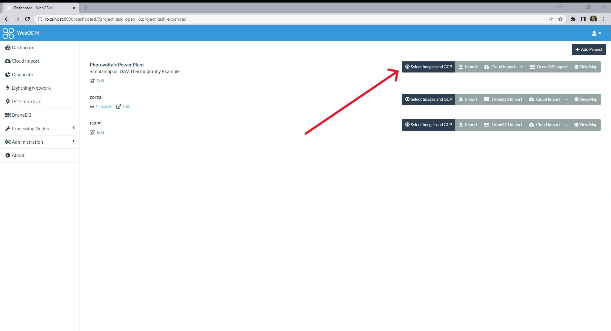
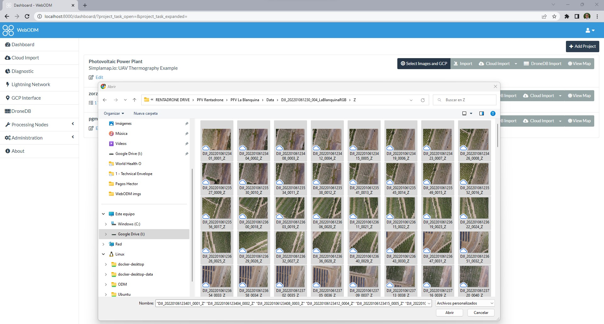
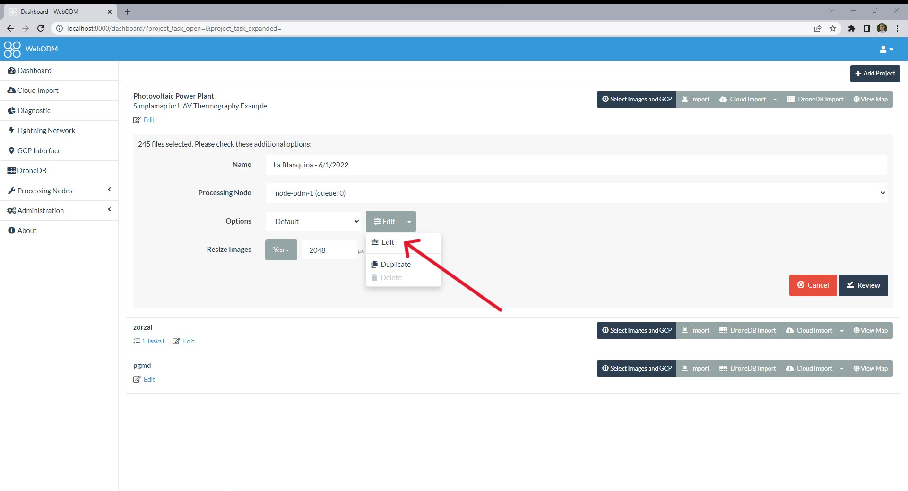
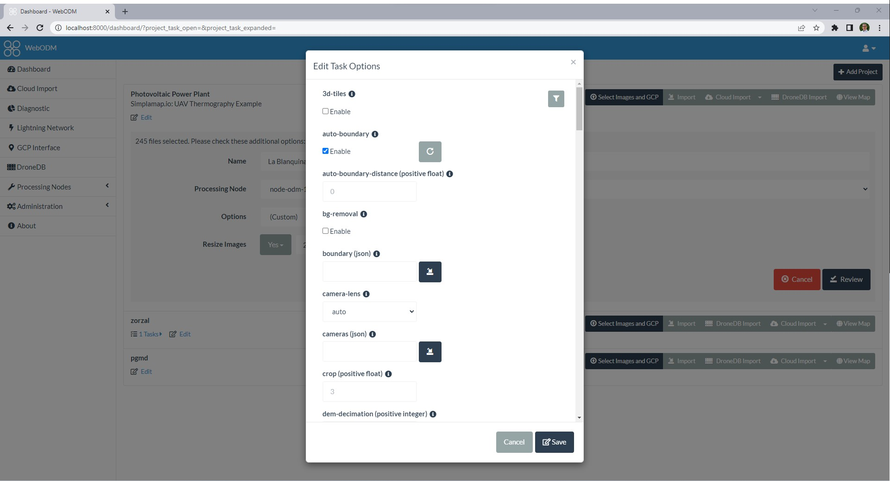
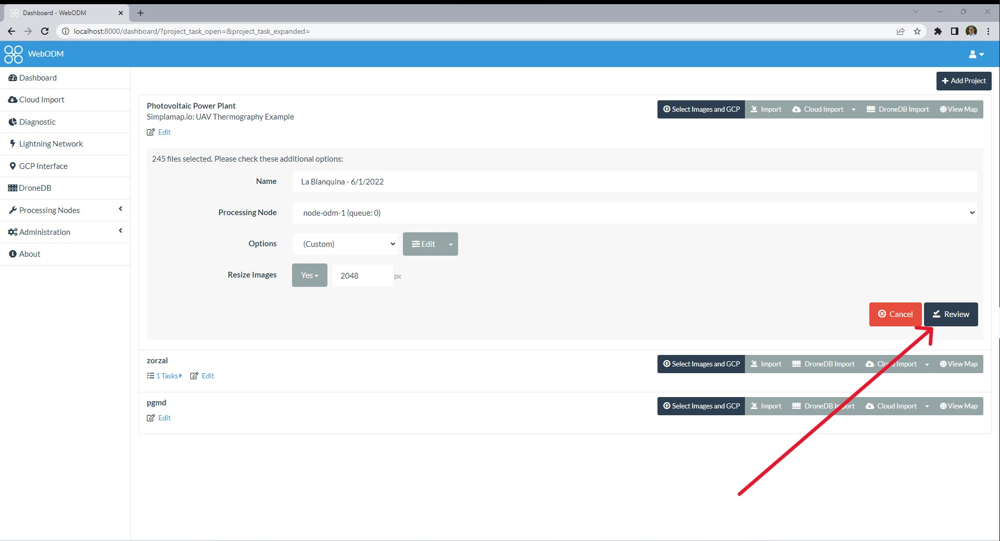
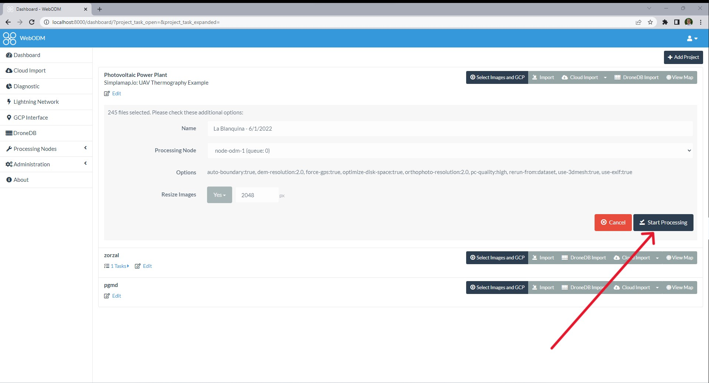

### UAV Thermography Procedures

# ASSET DIGITAL TWIN CREATION

## 1. RGB Orthomosaic
n this step, we create the RBG orthomosaic from our dataset of zoom RGB Images. To build the orthomosaic you can use any photogrammetry software on the market. In this tutorial, we will use WebODM, which is a user-friendly application of [**OpenDroneMap**](https://www.opendronemap.org/). Visit its website where you can read the instructions to install and use this aplication depending on your operation system.

* Input: dataset of geotagged RGB zoom 1X images taken whith DJI Martrice 300 RTK & DJI H20T camera (Format .JPG)
* Output: RGB Orthomosaic  (Format: geotiff .TIF, EP)

### Example of RGB Orthomosaic using OpenDroneMap

#### System details:
Device specifications:
* Processor Intel(R) Core(TM) i7-10750H CPU @ 2.60GHz 2.59 GHz,
* GPU: NVIDIA GeForce GTX 1650, NVIDIA-SMI 515.65.01, Driver Version: 516.94, CUDA Version: 11.7
* Installed RAM 16.0 GB (15.8 GB usable), 
* System type 64-bit operating system, x64-based processor
* Operating system: WSL2 in Windows 11 Home Edition 

#### Steps in WebODM:

1. Create your login and password to start using the application    
2. Press "+ Add Project" to create a new project    
3. Define the project name and description and press "+ Create Project"      
4. Press "Select Images and GPC" to upload the RGB Images    
5. In the opened window, select the RGB Zoom 1X Images    
6. Press "Edit" to configure the project parameters called "task options"    
7. Select the following "task options" configuration if you have the same general system specifications 

|Task|Option|l|Task|Option|l|Task|Option|
|:-:|:-:|-|:-:|:-:|-|:-:|:-:|
|3d-tiles:| *disable (empty)*|l| **auto-boundary:**|**enable**|l|*auto-boundary-distance (positive float):*| *default ("0")*|
|*bg-removal:*|*disable (empty)*|l|*boundary (json):*|*default (empty)*|l|*camera-lens:*|*default (auto)*|
|*cameras (json):*|*default (empty)*|l|*crop (positive float):*|*default ("3")*|l|*dem-decimation (positive integer):*|*default ("1")*|
|*dem-euclidean-map:*|*disable (empty)*-|l|*dem-gapfill-steps (positive integer):*|*default ("3")*|l|**dem-resolution (float):**|**2.0**|
|*dsm:*|*disable (empty)*|l|*dtm:*|*disable (empty)*|l|*end-with:*|*default ("odm_postprocess")*|
|*fast-orthophoto:*|*disable (empty)*|l|*feature-quality:*|*default ("high")*|l|*feature-type:*|*default ("sift")*|
|**force-gps:**|**enable**|l|*gps-accuracy (positive float):*|*default ("10")*|l|*ignore-gsd:*|*disable (empty)*|
|*matcher-neighbors (positive integer):*|*default ("0")*|l|*matcher-type:*|*default ("flann")*|l|*max-concurrency (positive integer):*|*default ("12")*|
|*merge:*|*default ("all")*|l|*mesh-octree-depth (integer: 1 <= x <= 14):*|*default ("11")*|l|*mesh-size (positive integer):*|*default ("200000")*|
|*min-num-features (integer):*|*default ("10000")*|l|**optimize-disk-space:**|**enable**|l|*orthophoto-cutline:*|*disable (empty)*|
|**orthophoto-resolution (float > 0.0):**|**2.0**|l|*pc-classify:*|*disable (empty)*|l|*pc-filter (positive float):*|*default ("2.5")*|
|**pc-quality:**|**high**|l|*pc-rectify:*|*disable (empty)*|l|*pc-sample (positive float):*|*default ("0")*|
|*pc-tile:*|*disable (empty)*|l|*primary-band (string):*|*default ("auto")*|l|*radiometric-calibration:*|*default ("none")*|
|**rerun-from:** |**dataset**|l|*rolling-shutter:*|*disable (empty)*|l|*rolling-shutter-readout (positive integer):*|*default ("0")*|
|*sfm-algorithm:*|*default ("incremental")*|l|*skip-3dmodel:*|*disable (empty)*|l|*skip-band-alignment:*|disable (empty)*|
|*skip-orthophoto:*|*disable (empty)*|l|*skip-report:*|*disable (empty)*|l|*sky-removal:*|*disable (empty)*|
|*sm-cluster (string):*|*default ("none")*|l|*sm-no-align:*|*disable (empty)*|l|*smrf-scalar (positive float):*|*default ("1.25")*|
|*smrf-slope (positive float):*|*default ("0.15")*|l|*smrf-threshold (positive float):*|*default ("0.5")*|l|*smrf-window (positive float):*|*default ("18")*|
|*split (positive integer):*|*default ("999999")*|l|*split-overlap (positive integer):*|*default ("150")*|l|*texturing-keep-unseen-faces:*|*disable (empty)*|
|*texturing-skip-global-seam-leveling:*|*disable (empty)*|l|*texturing-skip-local-seam-leveling:*|*disable (empty)*|l|*tiles:*|*disable (empty)*|
|**use-3dmesh:** |**enable**|l|**use-exif:**|**enable**|l|*use-fixed-camera-params:*|*disable (empty)*|
|*use-hybrid-bundle-adjustment:*|*disable (empty)*|l|**verbose:**|**enable**|l|||

   
8.     
9.     

## 2. Plant Vectorization
In this step, we import the RGB Orthomosaic into a CAD application that allows reading geotiff files. In our case, we will use AutoCAD 2020.  
It should be noted that this will be a manual process, in which each of the panels will be drawn using CAD tools. The orthomosaic is used as reference  to draw over the divisions between panels and strings, to produce a layout "as built" of the plant.

Process:
*Detailed process in next commits*

|*Content Maintainer*|
|-|
|*Hector Jose Bastidas Gonzalez* *hector.bastidas@simplemap.io*|